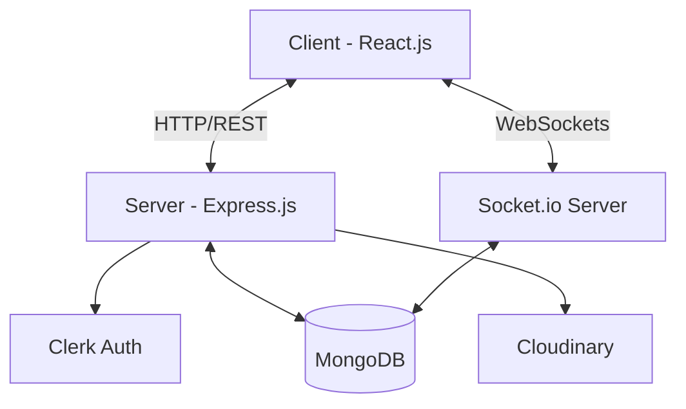
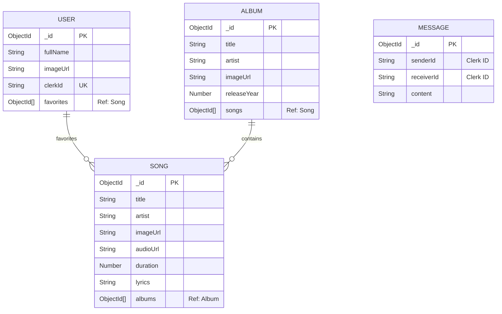
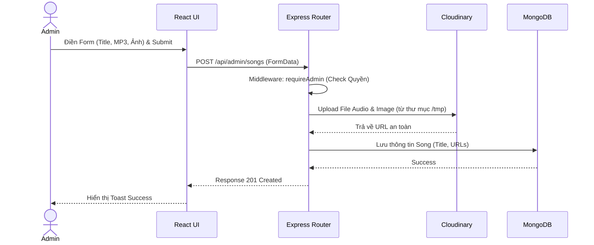

# Propersol3 Spotify Clone - Technical Documentation

Tài liệu kỹ thuật phân tích kiến trúc, cấu trúc thư mục, chức năng và cơ chế hoạt động của dự án ứng dụng stream nhạc trực tuyến (Spotify Clone).

---

## 1. Tổng quan dự án

- **Mục đích dự án**: Xây dựng một nền tảng stream nhạc trực tuyến toàn diện, cung cấp trải nghiệm nghe nhạc liền mạch kết hợp với các tính năng tương tác xã hội (chat thời gian thực) và hệ thống quản trị nội dung mạnh mẽ.
- **Bài toán giải quyết**: Đáp ứng nhu cầu phát nhạc trực tuyến mượt mà, quản lý thư viện âm nhạc (bài hát, album) cho quản trị viên, và cho phép người dùng giao tiếp với nhau ngay trên cùng một nền tảng.
- **Đối tượng sử dụng**: Người dùng cá nhân có nhu cầu nghe nhạc và các quản trị viên hệ thống (Admin) cần quản lý kho nhạc số.

---

## 2. Công nghệ sử dụng

### Frontend (Client-side)
- **React (Vite) & TypeScript**: Framework chính giúp xây dựng giao diện người dùng nhanh chóng với cấu trúc type-safe chặt chẽ.
- **Zustand**: Thư viện quản lý state toàn cục nhẹ và hiệu quả, dùng cho các tính năng: Phát nhạc (`usePlayerStore`), Xác thực (`useAuthStore`), Dữ liệu âm nhạc (`useMusicStore`), và Chat (`useChatStore`).
- **Tailwind CSS & Tailwind Merge/Animate**: Utility-first CSS framework giúp xây dựng giao diện linh hoạt, kết hợp animation mượt mà.
- **Radix UI**: Tập hợp các Headless UI Components (Dialog, Slider, Tabs, Scroll Area, Select) đảm bảo tính trợ năng (Accessibility) và khả năng tùy chỉnh giao diện (kiến trúc UI giống shadcn/ui).
- **Socket.io-client**: Kết nối WebSocket với Server để phục vụ tính năng chat thời gian thực.
- **Clerk (@clerk/clerk-react)**: Tích hợp giao diện và logic xác thực người dùng (Authentication).
- **Axios**: HTTP Client để giao tiếp với các REST API.

### Backend (Server-side)
- **Node.js & Express.js**: Runtime và Web Framework chính để xây dựng các API Endpoints và xử lý nghiệp vụ.
- **Socket.io**: WebSockets Server quản lý kết nối thời gian thực, đồng bộ trạng thái online và chuyển phát tin nhắn chat.
- **Mongoose**: Object Data Modeling (ODM) để thao tác dễ dàng với cơ sở dữ liệu MongoDB.
- **Cloudinary**: Dịch vụ lưu trữ đám mây (Cloud Storage) để lưu file âm thanh (.mp3) và hình ảnh bìa (thumbnail).
- **express-fileupload**: Middleware xử lý việc upload file tạm (multipart/form-data) từ client.
- **Node-cron**: Lên lịch thực hiện các tác vụ tự động (Cron job), cụ thể là dọn dẹp các tệp tạm thời mỗi giờ.
- **Clerk Express**: Middleware xác minh người dùng từ token của Clerk.

### Database
- **MongoDB**: Cơ sở dữ liệu NoSQL, phù hợp với kiến trúc linh hoạt của ứng dụng (lưu User, Song, Album, Message).

---

## 3. Kiến trúc hệ thống

Hệ thống được thiết kế theo kiến trúc **Client-Server** kết hợp giữa **RESTful API** và **WebSockets**:
- **Luồng xử lý REST API (Dữ liệu tĩnh)**: Client gửi HTTP Request → Express Middleware xác thực (Clerk) → Controller xử lý logic & gọi Model (Mongoose) → Phản hồi JSON về Client.
- **Luồng xử lý Real-time (Chat)**: Khi đăng nhập, Client thiết lập kết nối Socket.io. Server quản lý danh sách Users online. Khi có tin nhắn, Server lưu vào Database và broadcast trực tiếp đến người nhận qua Socket.
- **Luồng lưu trữ Media**: Quản trị viên upload nhạc/ảnh → Server lưu tạm tại thư mục `tmp/` → Upload lên Cloudinary → Lấy URL từ Cloudinary lưu vào MongoDB → Dọn dẹp thư mục `tmp/` định kỳ bằng `node-cron`.



---

## 4. Cấu trúc thư mục

Dự án áp dụng mô hình Monorepo đơn giản chia thành 2 thư mục chính: `fe` (Frontend) và `be` (Backend).

### Backend (`be/src/`)
- `models/`: Chứa các Mongoose Schemas (định nghĩa cấu trúc Database).
- `routes/`: Định nghĩa các API Endpoints, phân luồng request.
- `controller/`: Nơi chứa Business Logic xử lý cho từng route.
- `middleware/`: Chứa middleware chặn các request (vd: xác thực đăng nhập, kiểm tra quyền Admin).
- `lib/`: Các thư viện tiện ích (kết nối DB, khởi tạo Socket.io).
- `seeds/`: File script tạo dữ liệu mẫu (mock data) cho database.
- `server.js`: Entry point chính của Backend.

### Frontend (`fe/src/`)
- `pages/`: Các màn hình chính (Home, Admin, Album, Chat, Favorite).
- `components/`: Các UI components sử dụng chung.
- `layout/`: Các thành phần giao diện cố định (Sidebar, Player Controls).
- `stores/`: Quản lý state bằng Zustand (Auth, Chat, Music, Player).
- `providers/`: Context Providers bọc ngoài ứng dụng (AuthProvider).
- `hooks/`: Các Custom Hooks của React.

---

## 5. Database & Entities

Sơ đồ quan hệ thực thể (ERD) minh họa cấu trúc MongoDB thông qua Mongoose.



- **User**: Định danh người dùng đồng bộ từ Clerk thông qua `clerkId`. Lưu danh sách bài hát yêu thích.
- **Song**: Lưu thông tin bài hát và đường dẫn file MP3/Ảnh lưu trên Cloudinary.
- **Album**: Phân nhóm các bài hát.
- **Message**: Lưu lịch sử các đoạn chat giữa 2 người dùng.

---

## 6. Chức năng hệ thống

1. **Xác thực và Phân quyền**: Đăng nhập/Đăng ký qua Clerk. Phân quyền Admin tự động theo danh sách email cung cấp.
2. **Music Player**: Trình phát nhạc liên tục (Persistent Player) bằng Zustand. Cung cấp các thao tác Play, Pause, Next, Prev, điều chỉnh âm lượng.
3. **Quản lý Thư viện (User)**: Xem bài hát theo chủ đề (Trending, Featured, Made for you). Chức năng thêm/xóa bài hát khỏi danh sách Yêu thích.
4. **Nhắn tin Real-time**: Chat 1-1 trực tiếp, xem trạng thái Online/Offline của người dùng khác qua Socket.io.
5. **Dashboard Quản trị (Admin)**: 
   - Thống kê tổng quan (Số bài hát, album, người dùng).
   - CRUD (Thêm, Xóa) bài hát và Upload media trực tiếp lên Cloudinary.
   - Quản lý Album (Thêm, Xóa album, phân loại bài hát vào Album).

---

## 7. API Documentation

Các API được bảo vệ bằng middleware xác minh token từ Clerk (trừ các route đọc public).

| Method | URL | Mô tả | Yêu cầu Auth |
|---|---|---|---|
| **GET** | `/api/auth/callback` | Đồng bộ user từ Clerk vào MongoDB sau khi login. | Không |
| **GET** | `/api/users` | Lấy danh sách toàn bộ người dùng (cho tính năng chat). | Có |
| **GET** | `/api/users/favorites/details` | Lấy danh sách bài hát yêu thích chi tiết. | Có |
| **POST**| `/api/users/toggle-favorite` | Thêm/Xóa 1 bài hát vào mục Yêu thích. | Có |
| **GET** | `/api/users/messages/:userId` | Lấy lịch sử chat với một user khác. | Có |
| **GET** | `/api/songs` | Lấy toàn bộ bài hát. | Không |
| **GET** | `/api/songs/:id/lyrics` | Lấy lời bài hát. | Không |
| **GET** | `/api/songs/featured` | Lấy danh sách nhạc Featured. | Không |
| **GET** | `/api/albums` | Lấy toàn bộ danh sách Album. | Không |
| **GET** | `/api/albums/:id` | Lấy chi tiết Album (kèm các bài hát bên trong). | Không |
| **GET** | `/api/admin/check` | Kiểm tra quyền quản trị viên. | Có (Admin) |
| **POST**| `/api/admin/songs` | Tạo bài hát mới (FormData chứa file audio & ảnh). | Có (Admin) |
| **DEL** | `/api/admin/songs/:id` | Xóa bài hát. | Có (Admin) |
| **POST**| `/api/admin/albums` | Tạo Album mới (FormData chứa ảnh). | Có (Admin) |
| **DEL** | `/api/admin/albums/:id`| Xóa Album. | Có (Admin) |

---

## 8. Authentication & Authorization

- **Authentication (Xác thực)**:
  - Ứng dụng ủy quyền hoàn toàn luồng Đăng nhập / Đăng ký cho **Clerk**.
  - Client gửi Token lên Server. Express tích hợp `clerkMiddleware()` tự động xác thực và gắn đối tượng xác thực vào `req.auth`.
- **Authorization (Phân quyền - RBAC)**:
  - Middleware `protectRoute`: Kiểm tra sự tồn tại của `req.auth.userId`. Nếu không có, chặn (401).
  - Middleware `requireAdmin`: Kiểm tra email của `req.auth.userId` có nằm trong mảng `ADMIN_EMAIL` (biến môi trường `.env`) hay không. Nếu có mới cho phép thao tác sửa/xóa/thêm (403).

---

## 9. Business Logic Nổi Bật

### Quản lý File Tạm (Cron job)
Khi Admin upload bài hát mới bằng `express-fileupload`, file được lưu tạm thời vào thư mục `/tmp` tại server để Cloudinary đọc và tải lên đám mây.
Để tránh tình trạng phình to thư mục tạm, một cron job (`node-cron`) được chạy định kỳ mỗi 60 phút (Pattern `"0 * * * *"`) thực thi vòng lặp xóa (`fs.unlink`) tất cả các tập tin đang tồn tại trong `/tmp`.

### Hệ thống Chat Real-time
Giao tiếp giữa 2 client được duy trì qua Socket.io:
1. Client đăng nhập, gửi sự kiện báo online kèm ID. Server lưu vào Map `userSocketMap`.
2. Server phát lại sự kiện (broadcast) để cập nhật danh sách người dùng đang online.
3. Khi User A gửi tin nhắn cho User B, Server lưu nội dung vào DB, tìm Socket của B thông qua `userSocketMap` và chỉ phát sự kiện trực tiếp tới B, đảm bảo tính riêng tư.

---

## 10. Luồng xử lý nghiệp vụ mẫu (Tạo bài hát)



---

## 11. Bảo mật (Security)

- **CORS**: Được giới hạn với origin tĩnh thiết lập thông qua biến `CLIENT_URL` cùng cờ `credentials: true`.
- **Authentication**: Các endpoint quan trọng được bảo vệ 2 lớp (Yêu cầu đăng nhập + Yêu cầu email Admin).
- **Upload Hạn chế**: Middleware `express-fileupload` giới hạn dung lượng tải lên tối đa là 10MB (`fieldSize: 10 * 1024 * 1024`) tránh tấn công làm đầy bộ nhớ (DDoS).

---

## 12. Xử lý lỗi (Error Handling)

Hệ thống có Global Error Handling Middleware tại `server.js`.
- Bất kỳ lỗi nào (Exception) trong hệ thống sẽ được chuyển tới Middleware này.
- Khi ở môi trường `production`, nó sẽ trả lời `message: "Internal server error"` kèm status `500` để giấu cấu trúc/chi tiết lỗi (Stack trace). Ở môi trường `development`, thông báo lỗi chi tiết được trả về.

---

## 13. Biến môi trường (.env)

Cần tạo tệp `.env` riêng rẽ ở Backend và Frontend để chạy hệ thống:

**Backend (`be/.env`)**
| Biến | Mô tả |
|---|---|
| `PORT` | Cổng chạy Server (Mặc định 5000) |
| `MONGODB_URI` | Chuỗi kết nối đến cơ sở dữ liệu MongoDB Atlas |
| `ADMIN_EMAIL` | Danh sách các Email Admin cách nhau bởi dấu phẩy (VD: `a@gmail.com,b@gmail.com`) |
| `CLOUDINARY_API_KEY` | API Key kết nối với tài khoản Cloudinary |
| `CLOUDINARY_API_SECRET` | Secret Key xác thực tài khoản Cloudinary |
| `CLOUDINARY_CLOUD_NAME` | Cloud Name trên hệ thống Cloudinary |
| `NODE_ENV` | `development` hoặc `production` |
| `CLERK_PUBLISHABLE_KEY` | Public Key xác thực Clerk (BE) |
| `CLERK_SECRET_KEY` | Secret Key xác thực Clerk (BE) |

**Frontend (`fe/.env`)**
| Biến | Mô tả |
|---|---|
| `VITE_CLERK_PUBLISHABLE_KEY` | Public Key để khởi tạo Clerk React |

---

## 14. Hướng dẫn cài đặt

1. **Clone repository**:
   ```bash
   git clone <repo_url>
   cd propersol3_spotify
   ```
2. **Cài đặt thư viện**:
   - Backend: `cd be && npm install`
   - Frontend: `cd fe && npm install`
3. **Thiết lập Environment**:
   - Copy tệp `.env.example` thành `.env` cho cả `fe` và `be`, cung cấp đúng thông tin kết nối DB và Clerk.
4. **Khởi chạy ứng dụng (Môi trường Dev)**:
   - Terminal 1 (Backend): `npm run dev` (sẽ chạy server tại `http://localhost:5000`)
   - Terminal 2 (Frontend): `npm run dev` (sẽ mở trang React trên Vite)
5. **Build & Deploy Production**:
   - Chạy `npm run build` ở thư mục `fe`. Vite sẽ đóng gói file tĩnh (HTML, CSS, JS) vào thư mục `fe/dist`.
   - Server Node.js được cấu hình tự động phục vụ file tĩnh này khi biến `NODE_ENV=production`.
   - Start Server bằng `npm run start`.

---

## 15. Điểm mạnh của dự án

- **Kiến trúc rõ ràng**: Việc tách riêng Controllers, Routes, Models giúp code dễ bảo trì (Separation of Concerns).
- **Trải nghiệm người dùng tốt**: Quản lý State bằng Zustand giúp player nhạc không bị gián đoạn (persistent) khi chuyển trang. Cấu hình UI xịn xò với Tailwind và Radix UI.
- **Tính năng thời gian thực mạnh mẽ**: Việc tích hợp Socket.io cho phép theo dõi người dùng trực tuyến và nhắn tin lập tức, tăng mức độ tương tác.
- **Tối ưu băng thông Media**: Bằng cách sử dụng Cloudinary, server không cần lưu trữ vật lý các file nặng, đảm bảo hiệu suất tốt.

---

## 16. Hạn chế

- **Thiếu Data Validation**: Chưa sử dụng các công cụ rà soát body payload từ client một cách chặt chẽ (như Joi hoặc Zod).
- **Thiếu Rate Limiting & Security Headers**: Nên bổ sung `express-rate-limit` để chống Spam API và `helmet` để che giấu các header quan trọng.
- **Bảo vệ tài nguyên Cloudinary**: Chưa có logic tự động xóa các file trên Cloudinary nếu thao tác tạo bài hát/album trong CSDL thất bại.
- **Code Coverage**: Chưa tích hợp các công cụ viết Test (Unit Test với Jest).

---

## 17. Hướng phát triển trong tương lai

- Cải tiến tính năng Chat: Hỗ trợ chat nhóm (Group Chat) và gửi sticker/hình ảnh.
- Thuật toán Gợi ý: Gợi ý nhạc thông minh dựa theo lịch sử nghe hoặc bài hát yêu thích (Recommend System).
- Lời bài hát đồng bộ (Synchronized Lyrics): Lời bài hát karaoke chạy theo thời gian thực (LRC File parse).
- Tích hợp thanh toán (Stripe) để phân hạng User Free / Premium.
- Phân trang (Pagination) và Lazy loading danh sách nhạc cho Admin để tối ưu bộ nhớ.

---

## 18. Kết luận

Dự án là một hệ thống Music Streaming Platform hoàn chỉnh, có kiến trúc tốt cho một ứng dụng có quy mô tầm trung (Monolithic kết hợp SPA). Với việc giải quyết hiệu quả hai bài toán là Streaming Media đám mây và Tương tác WebSockets, đây là một minh chứng xuất sắc cho kỹ năng kết hợp các công nghệ MERN Stack hiện đại (Vite + Zustand + Socket.io + Clerk) vào phát triển phần mềm nghiệp vụ.